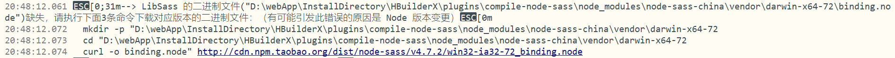

uni-app安装scss/sass后报错：LibSass 的二进制文件("{hbuilderx_install_floder}\plugins\compile-node-sass\node_modules\node-sass-china\vendor\darwin-x64-72\binding.node")缺失

---

situations reappeared：

在使用uni-app开发小程序时，因为引入了第三方组件使用了sass，HBuilder默认没有安装‘scss/sass’插件，导致编译报错，于是用IDE安装了一下，但是接着运行小程序又出现了如下错误：



主要错误信息：`二进制文件("{hbuilderx_install_floder}\plugins\compile-node-sass\node_modules\node-sass-china\vendor\darwin-x64-72\binding.node")缺失`

attributed error with analyses：

1. 出现`Cannot download "https://github.com/sass/node-sass/releases/download/版本号/XXX_binding.nod `的情况，一般是因为被墙掉了，那就用淘宝镜像安装：`$ npm i -g cnpm --registry=https://registry.npm.taobao.org `
2. 注意上面的报错：这个缺失（文件肯定下载下来了，否则他会报其他的错误），所以情况①排除。既然包文件不完整，那就去GitHub上下载对应版本的文件，以验证文件是否损坏，估计你会看到网上有人说自己到对应的地址例如Cannot download "https://github.com/sass/node-sass/releases/download/binding.node在浏览器打开就能直接下载一个win32-x64-59_binding.node文件然后再配置对应的路径到系统环境变量，但是我要告诉你的是，最好别这么做，因为你这样做很可能会导致版本问题而导致你在使用ionic命令的时候提示版本不同命令不可使用等问题！
3. 那么原因到底是为什么呢？那是因为你的确安装了sass而且也成功下载了相关文件了，只是你在执行时候可能是因为运气不好或者当前软件没设计好的原因没给你自动添加sass的环境变量
4. gain：可能还会有人担心问题是出在全局安装的`sass`版本与uni-app编译需要的版本不一致导致的。那你可以对`npm`中的`\npm-       cache\node-sass\4.12.0\win32-x64-64_binding.node `文件重命名，可以肯定，编译会报不存在`sass`的错误，那就可能会给出真正需要的版本号，再次运行编译，果然出现了如下错误：

```
17:57:25.735 --> LibSass 的二进制文件(C:\Users\Administrator\AppData\Roaming\npm-cache\node-sass\4.12.0\win32-x64-64_binding.node)缺失，请执行下面3条命令下载对应版本的二进制文件：（有可能引发此错误的原因是 Node 版本变更） 
17:57:25.751   mkdir -p C:\Users\Administrator\AppData\Roaming\npm-cache\node-sass\4.12.0
17:57:25.757   cd C:\Users\Administrator\AppData\Roaming\npm-cache\node-sass\4.12.0
17:57:25.763   curl -o win32-x64-64_binding.node http://cdn.npm.taobao.org/dist/node-sass/v4.7.2/win32-ia32-57_binding.node
17:57:25.771 --> MacOS 、Unix/Linux 请根据权限使用 sudo  
12345
```

这个提示信息中的关键其实是倒数第二段中的 `node-sass/v4.7.2/win32-ia32-57_binding.node`，这是需要下载的文件，版本号是 `v4.7.2`，到此终于明白了其实是原因是我们使用的二进制文件的版本不对，只需要用下载（命令行或者浏览器下载均可）后重命名覆盖之前的 `win32-x64-64_binding.node`文件即可。

如何下载指定版本的二进制文件呢？

node-sass官方github地址:[https://github.com/sass/node-sass/releases](https://links.jianshu.com/go?to=https%3A%2F%2Fgithub.com%2Fsass%2Fnode-sass%2Freleases)

node-sass淘宝镜像地址：[https://npm.taobao.org/mirrors/node-sass/](https://links.jianshu.com/go?to=https%3A%2F%2Fnpm.taobao.org%2Fmirrors%2Fnode-sass%2F)

##### 解决版本缺失问题：

我们需要把node-sass的二进制文件下载到本地来，这个文件可以选择去官方的github上下载或者去淘宝镜像官网下载,在下载之前我们需要知道自己的电脑适合下载哪个版本的，可在终端输入以下命令来查看我们需要下载哪个版本的二进制文件

```bash
node -p "[process.platform, process.arch, process.versions.modules].join('-')"
```

这时候会弹出自己电脑的系统版本，比如我弹出了“win32-x64-48”,则代表我需要下载"**win32-x64-48_binding.node** "这个二进制文件，

在安装指令后面我们还需要指定下载源。具体以 `node-sass `为例：

注意：`--sass-binary-path=`等号后面跟的就是我们之前下好的 `node-sass`二进制文件，举例：系统适合 `win32-x64-48_binding.node`，那么 `--sass-binary-path=`后面跟的就是 `{node-sass_installPath}/win32-x64-48_binding.node`（特别注意，分隔符是"/"并非直接拷贝电脑上路径的那种“\”），以下是完整的安装指令：　　

npm安装指令：

```cpp
npm install node-sass --save-dev --registry=http://registry.npm.taobao.org --sass-binary-path=E:/win32-x64-48_binding.node
```

yarn玩这个指令：

注意:yarn与npm采用不同的方式，yarn需要先指定node-sass的二进制下载地址为我们本地下载后的那个二进制文件，这样就可以在下载二进制文件的时候不从仓库去下载而使用本地的文件安装。

设置指令：

```bash
yarn config set sass-binary-path E:/win32-x64-48_binding.node
```

sass-binary-path 后面跟的东西就不再解释了，与Npm同理。

然后我可以正常安装no-sass了：

```csharp
yarn add node-sass --dev 
```

安装结束后我们就可以解除之前的设置，指令：

```cpp
yarn config delete sass-binary-path
```

---

#### 项目运行有可能会报错，提示找不到vendor文件目录

> 在node_modules/node-sass目录下手动创建vendor文件夹，根据电脑系统在创建相应的文件夹如win32-x64-64，在node-sass官网下载相应的文件，如'win32-x64-64_binding.node'，  将文件名称改为binding.node，粘贴在win32-x64-64文件下。
